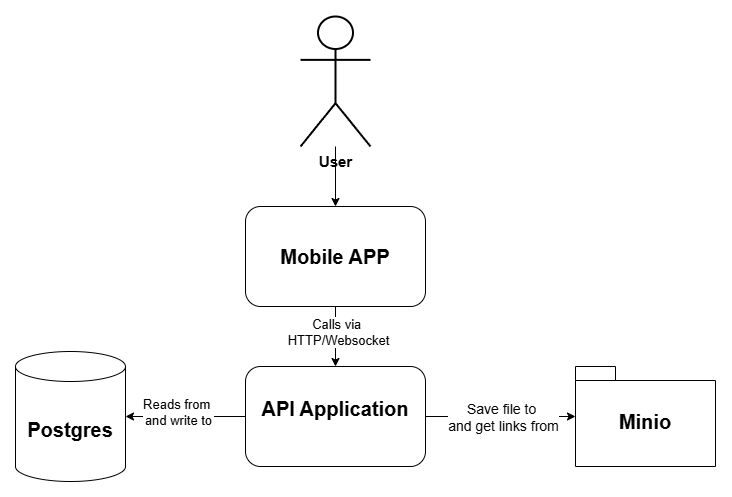
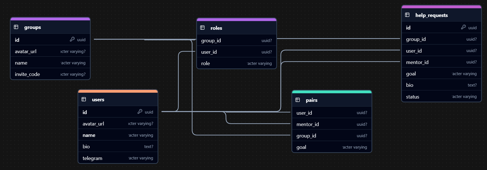

# Lotti - Система наставничества

## Содержание
- [Общая архитектура](#общая-архитектура)
- [Структура проекта](#структура-проекта)
- [База данных](#база-данных)

## Общая архитектура

### Компоненты системы

Проект включает следующие основные компоненты:

#### 1. Mobile APP
- Основной интерфейс взаимодействия с пользователем
- Обеспечивает доступ ко всем функциям системы
- Взаимодействует с backend через REST API и Websocket для реалтайм обновления данных

#### 2. Backend API
- Написан на Go
- Использует фреймворк gin для работы с HTTP и gorilla/mux для работы с Websocket для реалтайм обновления данных
- Имеет документацию swagger для всех доступных методов
- Управляет бизнес-логикой и доступом к данным
  - Использует библиотеку GORM для работы с базой данных и S3 хранилищем

#### 3. СУБД PostgreSQL
- Хранит все структурированные данные приложения
- Взаимодействует с Backend посредством SQL запросов

#### 4. Minio S3
- Используется для хранения изображений пользователей и групп
- Выдает ссылки с read-only доступом к ним

### Схема взаимодействия компонентов



## CI/CD-конфигурация
[Репозиторий с файлом пайплайнов и директорией джобов](https://gitlab.prodcontest.ru/team-14/lotti)

[Логи успешного деплоя](https://gitlab.prodcontest.ru/team-14/lotti/-/pipelines/16161)

## Исходный код
[Ссылка на проект с репозиториями в GitLab](https://gitlab.prodcontest.ru/team-14)

## API-Документация

Документация по взаимодействию с REST API сервера представлена в формате swagger и доступна по следующему адресу: [https://prod-team-14-mkg8u20m.final.prodcontest.ru/api/docs/index.html](https://prod-team-14-mkg8u20m.final.prodcontest.ru/api/docs/index.html)  
Актуальность документации достигается благодаря автогенерации документации при запуске CI
Тестовые данные:
1. Студент: ``
2. Ментор: ``
3. Владелец: ``

## Структура проекта

```
lotti/
├── cmd/
│   └── main.go              # Точка входа в приложение
├── internal/
│   ├── app/                 # Основная логика приложения
│   │   ├── Validators/      # Валидаторы
│   │   ├── helpers/         # Вспомогательные функции
│   │   ├── httpError/       # Стандартизация HTTP ошибок
│   │   ├── app.go           # Конфигурация приложения
│   │   ├── repository.go    # Интерфейсы репозиториев
│   │   └── service.go       # Интерфейсы сервисов
│   ├── connections/         # Подключения к внешним сервисам
│   │   ├── db/              # Подключение к PostgreSQL
│   │   ├── minio/           # Подключение к Minio
│   ├── models/              # Модели для базы данных
│   ├── pkg/                 # Общие пакеты
│   │   └── config/          # Конфигурация
│   ├── repository/          # Реализация репозиториев
│   ├── service/             # Реализация сервисов
│   ├── transport/           # Реализация транспорта
│   ├── deploy/              # Файлы для развертывания
│   └── docker-compose.tmpl  # Шаблон для docker-compose
```

## База данных

### ER-диаграмма



### Основные сущности

#### 1. User
- ID (UUID)
- Name (unique)
- AvatarURL
- BIO
- Telegram

#### 2. Group
- ID (UUID)
- Name
- AvatarURL
- InviteCode

#### 3. Role
- UserID (UUID)
- GroupID (UUID)
- Role (string)

#### 4. HelpRequest
- ID (UUID)
- UserID (UUID)
- MentorID (UUID)
- GroupID (UUID)
- Goal
- BIO
- Status

#### 5. Pair
- UserID (UUID)
- MentorID (UUID)
- GroupID (UUID)
- Goal

### Особенности и связи

1. **Пользователи (User)**
   - Вступают в группы по уникальным кодам приглашения
   - Могут быть членами множества групп через таблицу Role
   - Создают запросы на помощь (HelpRequest)
   - Выступают наставниками или студентами в парах (Pair)

2. **Группы (Group)**
   - Содержат множество участников через таблицу Role
   - Имеют запросы на помощь
   - Создают уникальный код приглашения

3. **Система ролей**
   - Реализована через таблицу Role
   - Связывает пользователей с группами
   - Определяет права доступа

4. **Запросы на помощь (HelpRequest)**
   - Связывают студента, наставника и группу
   - Имеют статус и цель
   - Преобразуются в пары

5. **Пары наставник-студент (Pair)**
   - Создаются из принятых запросов на помощь
   - Привязаны к группе
   - Имеют определенную цель взаимодействия